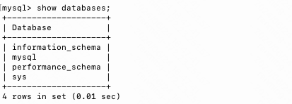
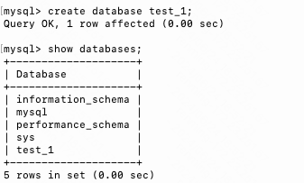

## tutorial 2
### 拥有自己的数据库
上一节我们学会了使用 docker 安装 Mysql，并且学会了一些 Mysql 的基础指令。接下来，我们将创建一个新的数据库，并且在新的数据库中创建几张表，最后进行数据的增删查改。

初始化 Mysql 后，会生成一些基础数据库，这些数据库记录了 Mysql 的使用记录、Mysql 的性能表现、用户信息等信息。



接下来，我们创建一个名为`test_1`的数据库。

```sql
create database test_1;
```



我们发现，Database 在最下面新增了一行`test_1`，这表示我们创建数据库成功。